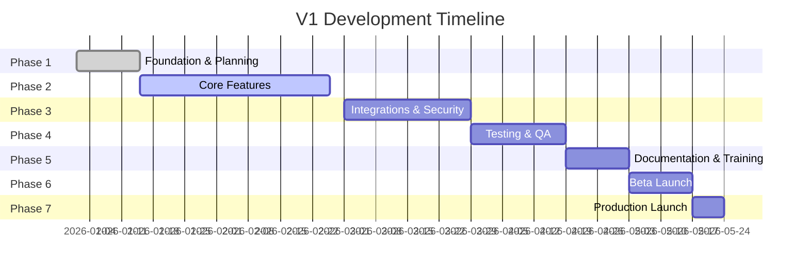

# Gistly V1 Launch Plan

This document outlines the comprehensive plan for launching Gistly Call Analytics V1, building upon the MVP foundation to deliver a production-ready platform.

<Info>
  **Target Launch Date**: Q2 2026 (Subject to development progress and feedback)
</Info>

## V1 Launch Overview

### MVP vs V1 Comparison

The transition from MVP to V1 represents a significant maturation of the platform, focusing on stability, scalability, and enhanced user experience.

| Aspect | MVP Status | V1 Target |
|--------|-----------|-----------|
| **Core Functionality** | Basic recording and analysis | Enhanced analysis with multi-modal AI |
| **User Interface** | Functional but minimal | Polished, intuitive UX with dark mode |
| **Performance** | Basic optimization | Optimized for 100+ concurrent users |
| **Integrations** | Attio only | Attio + HubSpot + Salesforce + custom webhooks |
| **Analytics** | Basic reports | Advanced dashboards with custom views |
| **Documentation** | Technical docs | Comprehensive user and admin guides |
| **Testing Coverage** | ~60% | >90% with E2E tests |
| **Security** | Basic auth | SSO, RBAC, audit logs |
| **Support** | Email only | In-app chat + help center + email |

### Key Features Planned for V1

#### 1. Enhanced AI Analysis
- Multi-model support (OpenAI, Anthropic, open-source options)
- Custom prompt templates for different industries
- Sentiment analysis with emotion detection
- Competitive intelligence extraction
- Topic clustering and trend analysis

#### 2. Advanced Integrations
- **CRM**: Bidirectional sync with HubSpot and Salesforce
- **Communication**: Slack and Microsoft Teams notifications
- **Calendar**: Google Calendar and Outlook integration
- **Storage**: Direct export to Google Drive, Dropbox, OneDrive
- **Webhooks**: Custom webhook system for extensibility

#### 3. Improved User Experience
- Dark mode support
- Customizable dashboards
- Advanced search and filtering
- Batch operations for meeting management
- Mobile-responsive design improvements
- Keyboard shortcuts and accessibility features

#### 4. Analytics & Reporting
- Custom report builder
 Scheduled report generation
- Executive summary dashboards
- Team performance comparisons
- Coaching recommendations
- ROI calculator for meetings

#### 5. Security & Compliance
- Single Sign-On (SSO) with SAML 2.0
- Role-Based Access Control (RBAC)
- Audit logging for all actions
- Data retention policies
- GDPR compliance tools
- SOC 2 Type II certification preparation

### Timeline Considerations

<Warning>
  Timeline is subject to change based on MVP feedback, technical challenges, and market conditions.
</Warning>

## Feature Planning

### New Features Planned

<AccordionGroup>
  <Accordion title="AI-Powered Coaching Assistant">

    - Real-time conversation suggestions during calls
    - Post-meeting coaching recommendations
    - Best practice identification from top performers
    - Personalized learning paths based on call analysis
    - Competitor battle card suggestions
  </Accordion>

  <Accordion title="Advanced Search & Discovery">

    - Full-text search across all transcripts
    - Filter by sentiment, topics, speakers
    - Similar meeting recommendations
    - Saved search queries
    - Search alerts for specific keywords
  </Accordion>

  <Accordion title="Collaboration Features">

    - Comment threads on specific transcript segments
    - @mentions and notifications
    - Shared playlists and highlight reels
    - Team annotation and tagging
    - Collaborative report building
  </Accordion>

  <Accordion title="Automation & Workflows">

    - Custom workflow builder
    - Automated lead scoring based on calls
    - Trigger-based actions (e.g., follow-up reminders)
    - Integration with Zapier and Make
    - Custom API for advanced automations
  </Accordion>
</AccordionGroup>

### Improvements to MVP Features

#### Meeting Recording
- **Current**: Single recording source
- **V1**: Multiple recording sources with intelligent merging
- Support for video recording with screen share capture
- Automatic noise reduction and audio enhancement
- Backup recording for reliability

#### Transcription
- **Current**: Basic transcription
- **V1**: Multi-language support with auto-detection
- Speaker diarization improvements
- Custom vocabulary and industry terms
- Real-time transcription preview
- Timestamp navigation in transcripts

#### Analysis Engine
- **Current**: GPT-4 analysis
- **V1**: Multi-model ensemble approach
- Customizable analysis frameworks
- Industry-specific insight templates
- Conversation quality scoring
- Objection handling analysis

#### Dashboard
- **Current**: Basic metrics display
- **V1**: Fully customizable dashboard layouts
- Drag-and-drop widget system
- Custom metric calculations
- Export and sharing capabilities
- Mobile-optimized views

### Technical Debt Items

<Steps>
  <Step title="Frontend Optimization">

  - Component refactoring for better reusability
  - State management consolidation
  - Bundle size reduction (target: <500KB initial load)
  - Image optimization and lazy loading
  - Service worker for offline support
  - Performance monitoring integration
  </Step>

  <Step title="Backend Improvements">

  - API response time optimization (target: <200ms p95)
  - Database query optimization and indexing
  - Caching layer implementation (Redis)
  - Background job processing optimization
  - WebSocket implementation for real-time updates
  - Rate limiting and throttling improvements
  </Step>

  <Step title="Testing Infrastructure">

  - Increase unit test coverage to >80%
  - Implement comprehensive E2E test suite
  - Load testing infrastructure setup
  - Automated visual regression testing
  - Security scanning integration
  - Performance testing automation
  </Step>

  <Step title="DevOps & Deployment">

  - Infrastructure as Code (Terraform) implementation
  - Multi-environment setup (dev, staging, prod)
  - Blue-green deployment strategy
  - Automated rollback procedures
  - Monitoring and alerting improvements
  - Log aggregation and analysis setup
  </Step>
</Steps>

## Documentation Structure for V1

### User Guides

<Callout type="info" title="Comprehensive User Documentation">

  V1 requires extensive user-facing documentation to ensure successful adoption and reduce support burden.
</Callout>

#### Getting Started
- **Quick Start Guide** - 5-minute setup walkthrough
- **User Onboarding** - Step-by-step first-time user experience
- **Account Setup** - Organization creation and user invitation
- **First Recording** - Guide to recording your first meeting
- **Understanding Your Dashboard** - Dashboard navigation and features

#### Feature Guides
- **Recording Meetings** - Comprehensive recording guide
  - Supported platforms and configurations
  - Audio/video quality best practices
  - Troubleshooting recording issues
- **Analyzing Conversations** - Understanding AI analysis
  - Reading analysis reports
  - Customizing analysis settings
  - Interpreting red flags and insights
- **Using Reports** - Report generation and customization
  - Meeting reports
  - Trend analysis
  - Red flag reports
  - Custom reports
- **Managing Integrations** - Connecting external tools
  - CRM integration guides
  - Communication tool setup
  - Webhook configuration
- **Collaboration** - Working with your team
  - Sharing meetings and reports
  - Commenting and feedback
  - Team analytics
- **Settings & Preferences** - Personalization options
  - Profile settings
  - Notification preferences
  - Security settings

#### Advanced Features
- **Custom Workflows** - Building automation
- **API Access** - Programmatic access
- **Advanced Search** - Power user search techniques
- **Data Export** - Exporting and backing up data

### API Documentation Updates

#### API Reference
- **Authentication** - Detailed auth flow documentation
- **Endpoints** - Complete endpoint reference
  - Meetings API
  - Analysis API
  - Reports API
  - Users & Organizations API
  - Webhooks API
  - Integrations API
- **Webhooks** - Webhook configuration and events
- **SDKs** - Official SDK documentation (Python, JavaScript)
- **Rate Limiting** - Understanding limits and best practices
- **Error Handling** - Error codes and resolution

#### Integration Guides
- **CRM Integration** - Detailed CRM setup guides
  - Attio Integration
  - HubSpot Integration
  - Salesforce Integration
- **Custom Integrations** - Building custom integrations
- **Webhook Examples** - Real-world webhook implementations

### Admin Guides

#### Organization Management
- **Organization Setup** - Initial configuration
- **User Management** - Adding and managing users
- **Team Structure** - Organizing teams and permissions
- **Billing & Plans** - Subscription management
- **Security Settings** - Configuring security options

#### Monitoring & Maintenance
- **Analytics Dashboard** - Understanding organization metrics
- **Audit Logs** - Reviewing activity logs
- **Data Management** - Data retention and exports
- **Troubleshooting** - Common issues and solutions

#### Compliance & Security
- **GDPR Compliance** - Data protection features
- **SOC 2 Preparation** - Security controls documentation
- **SSO Configuration** - Setting up single sign-on
- **Access Control** - Managing permissions and roles

## Launch Checklist

### Pre-Launch Tasks (4-6 Weeks Before)

<AccordionGroup>
  <Accordion title="Product & Features">

  <Checklist>
    Complete all V1 core features
    Conduct internal beta testing
    Fix critical bugs identified in testing
    Performance optimization complete
    Security audit completed and addressed
    Accessibility audit and improvements
    Mobile responsiveness verified
    Cross-browser testing completed
    Integration testing with all partners
  </Checklist>
  </Accordion>

  <Accordion title="Documentation">

  <Checklist>
    All user guides written and reviewed
    API documentation updated
    Admin guides completed
    Video tutorials created
    FAQ section populated
    Changelog maintained
    Release notes drafted
    Help center articles published
    Translation prepared (if applicable)
  </Checklist>
  </Accordion>

  <Accordion title="Infrastructure & DevOps">

  <Checklist>
    Production environment configured
    Monitoring and alerting setup
    Backup and disaster recovery tested
    SSL certificates configured
    CDN configuration optimized
    Database scaling configured
    Load balancer setup
    Auto-scaling rules configured
    Log aggregation working
    Performance monitoring (APM) integrated
  </Checklist>
  </Accordion>

  <Accordion title="Security & Compliance">

  <Checklist>
    Security penetration testing completed
    SSO integration tested
    RBAC implementation verified
    Audit logging enabled and tested
    Data retention policies configured
    GDPR compliance verified
    Privacy policy updated
    Terms of service updated
    Cookie policy configured
  </Checklist>
  </Accordion>

  <Accordion title="Support & Operations">

  <Checklist>
    Support team trained on V1 features
    Support documentation and runbooks created
    Customer communication templates prepared
    Onboarding flow tested
    In-app support chat configured
    Help center setup and tested
    Feedback collection mechanisms in place
    Issue escalation process defined
    On-call rotation established
  </Checklist>
  </Accordion>

  <Accordion title="Marketing & Communications">

  <Checklist>
    Launch announcement drafted
  Email campaigns prepared
  Blog posts written
  Social media content scheduled
  Press kit prepared
  Demo videos created
  Case studies collected
  Customer testimonials gathered
  Website updated with V1 information
  </Checklist>
  </Accordion>
</AccordionGroup>

### Launch Day Tasks

<Steps>
  <Step title="Morning Of Launch">

  <Checklist>
    Final health check of all systems
    Deploy production release
    Smoke tests on critical paths
    Verify integrations are working
    Enable V1 features for users
    Update status page (if applicable)
  </Checklist>
  </Step>

  <Step title="Launch Announcement">

  <Checklist>
    Send launch announcement emails
    Publish blog post
    Update social media channels
    Notify existing users
    Press release distribution
    Community announcement (if applicable)
  </Checklist>
  </Step>

  <Step title="Launch Day Monitoring">

  <Checklist>
    Monitor system metrics closely
    Watch error rates and response times
    Track user sign-ups and activations
    Monitor support channels
    Be ready to address issues quickly
    Collect initial user feedback
  </Checklist>
  </Step>

  <Step title="End Of Day">

  <Checklist>
    Review launch day metrics
    Document any issues encountered
    Plan fixes for any problems
    Celebrate the launch team!
  </Checklist>
  </Step>
</Steps>

### Post-Launch Tasks (Weeks 1-4)

<AccordionGroup>
  <Accordion title="Week 1: Stability">

  <Checklist>
    Daily stability reviews
    Rapid bug fix turnaround
    User support prioritized
    Collect and categorize feedback
    Monitor system performance
    Address critical issues immediately
    Publish known issues document
  </Checklist>
  </Accordion>

  <Accordion title="Week 2: Optimization">

  <Checklist>
    Analyze usage patterns
    Optimize bottlenecks
    Address high-priority feedback
    Improve documentation gaps
    Performance tuning
    Enhance error messages
    Create FAQ for common issues
  </Checklist>
  </Accordion>

  <Accordion title="Week 3: Enhancement">

  <Checklist>
    Plan next feature sprint
    Address medium-priority issues
    User interview sessions
    Create improvement roadmap
    A/B test key UX improvements
    Update guides based on feedback
  </Checklist>
  </Accordion>

  <Accordion title="Week 4: Review">

  <Checklist>
    Launch retrospective meeting
    Document lessons learned
    Update internal documentation
    Plan V1.1 release
    Share launch metrics with team
    Recognize team contributions
    Prepare case studies from early users
  </Checklist>
  </Accordion>
</AccordionGroup>

## Success Metrics

### User Adoption Metrics

<Callout type="warning" title="KPI Targets for V1 Launch (First 90 Days)">

  These targets should be adjusted based on actual user base size and market conditions.
</Callout>

| Metric | Target | Measurement |
|--------|--------|-------------|
| **User Activation** | 70% of sign-ups complete onboarding | Percentage of users who record first meeting within 7 days |
| **Weekly Active Users** | 60% of registered users | Users who record or analyze at least one meeting per week |
| **Feature Adoption** | 50% use advanced features | Percentage of users using reports, sharing, or integrations |
| **User Retention** | 40% retention after 30 days | Percentage of users still active after 30 days |
| **Meeting Volume** | 10,000+ meetings processed | Total meetings analyzed in the first 90 days |
| **Organization Growth** | 100+ organizations | Number of active organizations using the platform |

### Performance Metrics

| Metric | Target | Measurement |
|--------|--------|-------------|
| **System Uptime** | 99.9% | Percentage of time system is available |
| **API Response Time** | <200ms (p95) | 95th percentile response time for API calls |
| **Processing Speed** | <5 min/meeting | Time from recording upload to analysis complete |
| **Error Rate** | <0.1% | Percentage of failed requests |
| **Page Load Time** | <2s | Initial page load time for dashboard |
| **Transcription Accuracy** | >95% | Word error rate for transcriptions |
| **Analysis Quality** | >4.0/5.0 | User rating of analysis quality |

### User Engagement Metrics

| Metric | Target | Measurement |
|--------|--------|-------------|
| **Average Sessions/Week** | 5+ | Number of times users access the platform per week |
| **Time in Platform** | 15+ min/session | Average time spent per session |
| **Report Views** | 3+ reports/user/week | Number of reports viewed per user per week |
| **Feature Usage** | 3+ features/user | Number of distinct features used per user |
| **Sharing Rate** | 30% of meetings shared | Percentage of meetings shared with team members |
| **Integration Usage** | 40% use integrations | Percentage of users with active integrations |

### Quality & Satisfaction Metrics

| Metric | Target | Measurement |
|--------|--------|-------------|
| **NPS Score** | >50 | Net Promoter Score from user surveys |
| **CSAT Score** | >4.5/5.0 | Customer satisfaction score |
| **Support Satisfaction** | >4.5/5.0 | Satisfaction with support interactions |
| **Bug Report Rate** | <2% of users | Percentage of users submitting bug reports |
| **Feature Request Rate** | >20% of users | Percentage of users submitting feature requests |
| **Documentation Quality** | >4.0/5.0 | User rating of documentation helpfulness |

### Business Metrics

| Metric | Target | Measurement |
|--------|--------|-------------|
| **Conversion Rate** | 15% free to paid | Percentage of free users converting to paid plans |
| **ARPU** | $50+/month | Average revenue per user |
| **CAC Recovery** | <6 months | Time to recover customer acquisition cost |
| **Churn Rate** | <5% monthly | Percentage of users cancelling subscription |
| **Expansion Revenue** | 20% of MRR | Revenue from upgrades and add-ons as % of MRR |
| **Referral Rate** | >25% | Percentage of new users from referrals |

### Feedback Collection Mechanisms

<Steps>
  <Step title="In-App Feedback">

  - Feedback button on every page
  - Post-meeting rating prompts
  - Feature usage surveys
  - Contextual feedback requests
  </Step>

  <Step title="User Research">

  - Weekly user interviews (5-10 users)
  - Quarterly user surveys
  - User advisory board meetings
  - Usability testing sessions
  - Customer advisory calls
  </Step>

  <Step title="Support Interactions">

  - Support ticket analysis
  - Chat conversation review
  - Feature request tracking
  - Bug report categorization
  </Step>

  <Step title="Product Analytics">

  - Funnel analysis
  - Cohort analysis
  - Feature usage heatmaps
  - A/B testing results
  - Session recordings
  </Step>
</Steps>

### Monitoring & Reporting

<AccordionGroup>
  <Accordion title="Real-Time Dashboards">

  - System health and performance
  - Active user counts
  - Meeting processing queue
  - Error rates and types
  - Resource utilization
  </Accordion>

  <Accordion title="Daily Reports">

  - Daily active users
  - Meetings processed
  - New sign-ups
  - Support tickets
  - System incidents
  </Accordion>

  <Accordion title="Weekly Reports">

  - User growth and retention
  - Feature adoption rates
  - Performance trends
  - Support satisfaction
  - Feedback themes
  </Accordion>

  <Accordion title="Monthly Reports">

  - Comprehensive KPI review
  - Business metrics analysis
  - User sentiment analysis
  - Competitive analysis
  - Roadmap progress
  </Accordion>
</AccordionGroup>

---

## Next Steps

<Callout type="info" title="Launch Readiness Assessment">

  Schedule a launch readiness review 2 weeks before target date to assess completion of all checklist items and address any gaps.
</Callout>

1. **Review and finalize this plan** with all stakeholders
2. **Create detailed project plan** with assigned owners and deadlines
3. **Set up tracking** for all success metrics
4. **Schedule regular check-ins** (weekly for first 6 weeks, bi-weekly thereafter)
5. **Prepare contingency plans** for common launch issues
6. **Align marketing efforts** with launch timeline
7. **Train support team** on V1 features and common issues
8. **Celebrate milestones** to keep team motivated

<Card
  title="Launch Readiness Quiz"
  icon="clipboard-check"
  href="https://docs.google.com/forms"
  horizontal
>
  Take the launch readiness assessment to ensure all teams are prepared for V1 launch.
</Card>

---

**Last Updated**: 2026-01-08
**Document Owner**: Product Team
**Review Frequency**: Weekly during development, daily during launch week
